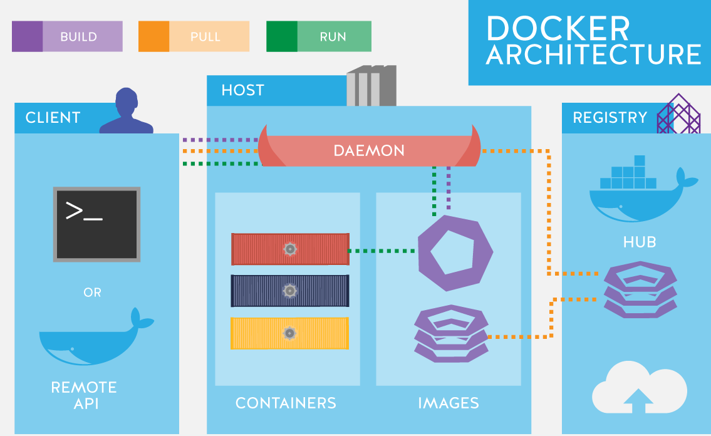

what is docker?
===============

Docker is a super slim virtual machine, which can run your software.

What is a difference between VM and Docker?

VM will have a host OS underlying the guest VM OS
that gives some overhead. 

Docker engine in details:

docker interaction:

The Docker daemon is listening for Docker API requests and managing docker objects. We will deal with the following ones:

- image
- container
- volume
- network

Heres an overall structure of the docker architecture:

As you see client is, usually using cli or rest api to work with docker.

The examples of cli api usage:

- docker run -i -t ubuntu /bin/bash
- docker pull ubuntu
- docker build

The examples of the rest commands to docker:
https://docs.docker.com/develop/sdk/examples/
