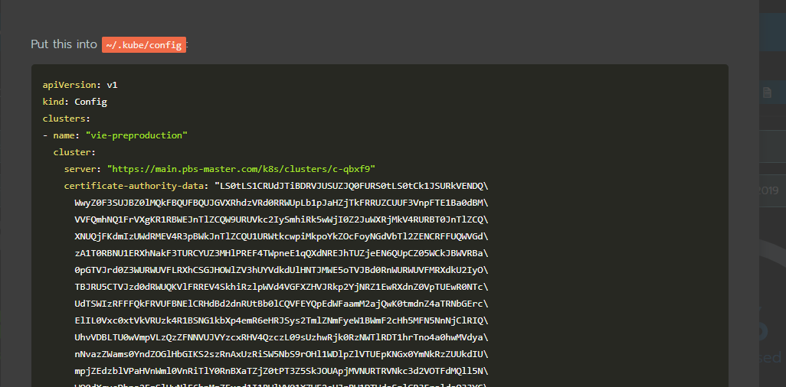

install tools
=============

#install and configure kubectl

https://kubernetes.io/docs/tasks/tools/install-kubectl/#install-kubectl-on-windows

download the kubectl here and put it somewhere, where path is used, or add the download location to Path variable.
For that go "Advanced System Settings -> Advanced -> Environment Variables -> Path" and edit the variable to have the path to the kubectl.exe

now lets connect our kubectl to the kubernetes cluster.

- open rancher by going to [rancher](https://main.pbs-master.com/c/c-qbxf9/monitoring)
- click the kube config button

you'll see a popup with the certificate:

copy the whole text and put it under the under the path it states, for me it's [C:\Users\fname.lname\\.kube](C:\Users\fname.lname\\.kube)

if it gives you strange errors - logout and login again to propagate the kubectl variable. 

Or you can go to [C:\Program Files\Docker\Docker\resources\bin](C:\Program Files\Docker\Docker\resources\bin) and delete the kubectl that resides there.

The namespace in rancher that we should use is test-research. Of course you can create a fancy name and use it as well if theres a reason for it.

--------------------

#install and configure helm 

follow the instructions from [https://github.com/helm/helm/blob/master/docs/install.md](https://github.com/helm/helm/blob/master/docs/install.md)
excute `helm init --client-only`

this will result in a lot of files added to [C:\Users\fname.lname\\.helm](C:\Users\fname.lname\\.helm) folder.
