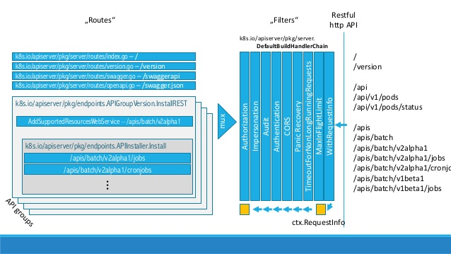

general pipeline overview
=========================

the general pipeline looks like this:

###main kubernetes components:

kube api server

- kube api server - gateway for all the clients. 
- checks and configures all the API-objects( pods, replica sets, services etc )
- etcd - distributed data storage, where the state of the cluster is stored.

Kubelet talks to API-server. deploys pods according to pod spec( which is yaml or json ).

kube-proxy

- proxying tcp and udp, not http.
- only used to work with services.
- internal load balancing

kube controller manager

- checks the state of the objects in etcd, such as
 replication controller, endpoints controller, namespace controller, serviceaccounts controller

API-server is used to have some state of the controllers, based on the state in the etcd.

kube scheduler

- handles the resource management
- makes sure resources are limited as needed
- decides where to run the pods
- affinity/anti-affinity - how containers are located, together or separated.

same in greater details and with a rubber duck

with legends for protocols interaction

kubectl goes to kube-API-Server when you communicate to it to ask to deploy anything or check the state of the objects.

###YAML file structure, how are objects described?

apiVersion, kind and metadata are mandatory

apiVersion can be of 3 types:

- alpha - testing stage, can be deleted( v1alpha1 )
- beta - safe but can be changed( v1beta )
- stable - included in the release( v1 )

